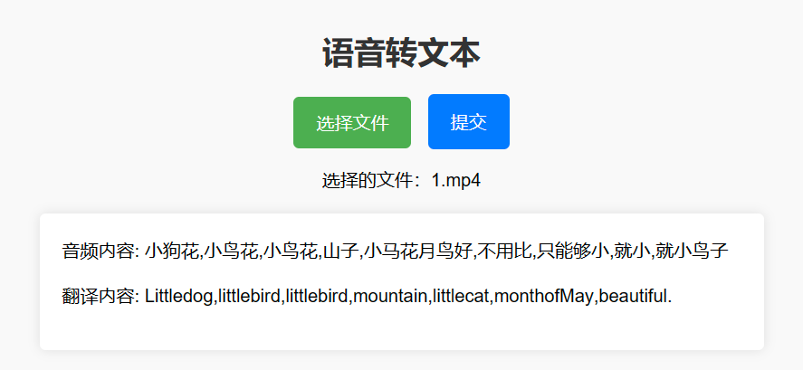

# 音频中英文翻译


## 介绍

通过对语音识别模型以及大模型的调用，实现对音视频的内容提取，根据提取内容进行中英文互译，并生成字幕文件。该项目使用的开源模型whisper、 glm-6b需要至少 6G 显存（实测最少5.2G），**模型越小占用显存越少，速度也更快，但精度也更低**，所以在使用时需要自己在速度和准确度之间权衡。以下是可用模型的名称、显存需求和相对速度。
### whisper
| **Size**   | **Parameters** | **English-only model** | **Multilingual model** | **Required VRAM** | **Relative speed** |
| ------ | ---------- | ------------------ | ------------------ | ------------- | -------------- |
| tiny   | 39 M       | tiny.en            | tiny               | ~1 GB         | ~32x           |
| base   | 74 M       | base.en            | base               | ~1 GB         | ~16x           |
| small  | 244 M      | small.en           | small              | ~2 GB         | ~6x            |
| medium | 769 M      | medium.en          | medium             | ~5 GB         | ~2x            |
| large  | 1550 M     | N/A                | large              | ~10 GB        | 1x             |
### glm-6b
| **量化等级**  | **最低 GPU 显存**（推理） | **最低 GPU 显存**（高效参数微调） |
| --------- | ----------------- | --------------------- |
| FP16（无量化） | 13 GB             | 14 GB                 |
| INT8      | 8 GB              | 9 GB                  |
| INT4      | 6 GB              | 7 GB                  

## 环境安装

### glm-6b安装
```bash
git clone https://huggingface.co/THUDM/chatglm-6b
```

### 建议最好新建一个conda环境
```bash
pip install -r requirements.txt
```
特别注意torch版本不低于1.10（也别用最新的），transformers为4.27.1。

### whisper 安装
```bash
pip install -U openai-whisper
```

### 另外需要安装ffmpeg，不同系统参考不同方式

```bash
# on Ubuntu or Debian
sudo apt update && sudo apt install ffmpeg

# on Arch Linux
sudo pacman -S ffmpeg

# on MacOS using Homebrew (https://brew.sh/)
brew install ffmpeg

# on Windows using Chocolatey (https://chocolatey.org/)
choco install ffmpeg

# on Windows using Scoop (https://scoop.sh/)
scoop install ffmpeg
```


## 开始使用

### 运行根目录下app.py

```bash
python app.py
```

### WEB DEMO

打开  http://127.0.0.1:5000/static/index.html 选择音频文件并上传



