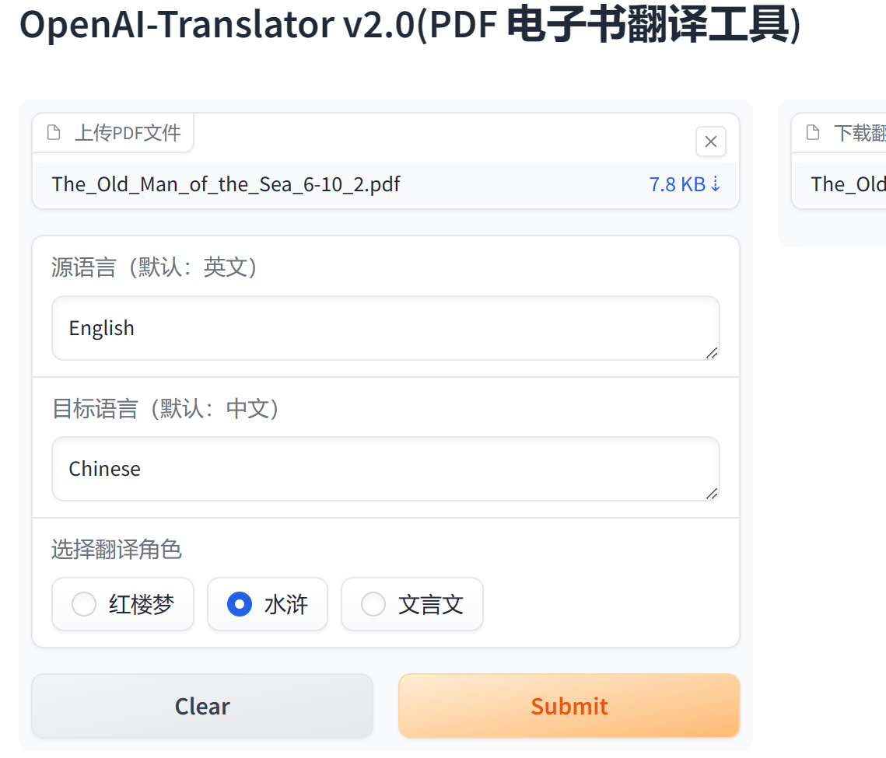
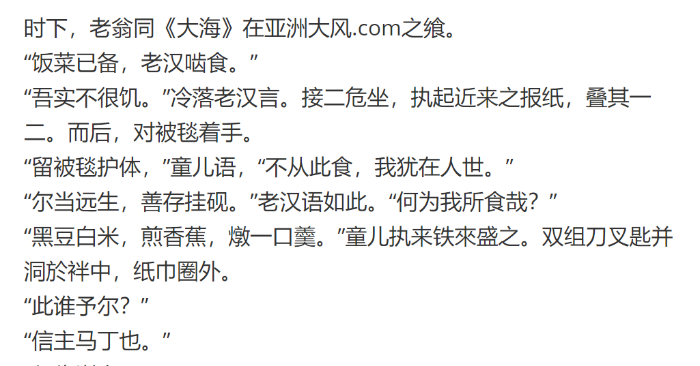

## 介绍

在 openai-translator gradio 图形化界面基础上，支持风格化翻译。

## 改造说明
gradio_server.py文件
1、web端增加翻译角色风格，示例代码：gr.Radio(["红楼梦", "水浒","文言文"], label="选择翻译角色")。
2、translation方法增加translation_role参数
pdf_translator文件
3、translate_pdf方法增加translation_role参数
translation_chain文件
4、修改提示词模板，由英文改为中文提示词
        template = (
            """你是一位翻译专家，精通各种风格的语言翻译， \n
            从 {source_language} 翻译成 {target_language}，使用{translation_role}风格翻译。"""
        )
5、run方法增加translation_role参数

## 运行说明

## 示例结果
增加红楼梦、水浒、文言文翻译风格，示例为文言文角色风格

